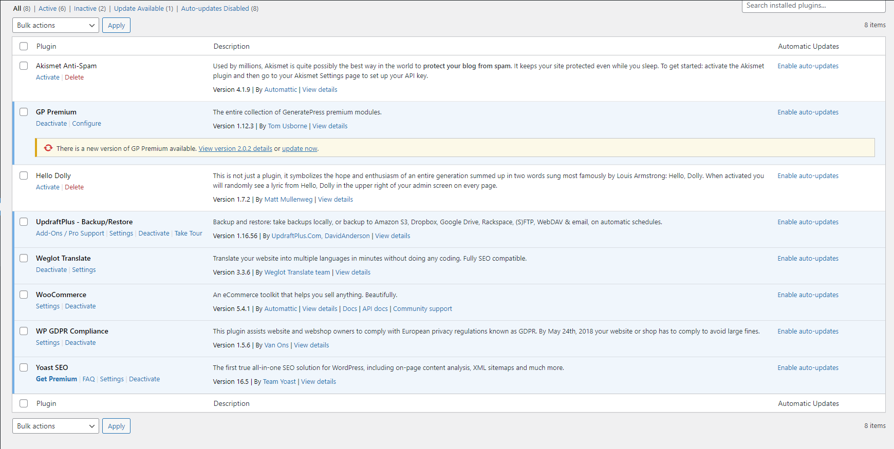

## Installation
- Telecharger le zip [Wordpress](https://wordpress.org/)
 et l'extraire
- Créer la base de données `PB8` sur MySQL
- Utiliser un webserver (eg: Apache, Xampp..) pour héberger l'application, 
`http://pb8/`

## Authentification
root 
1234

## Plugins

- **Blocksy Companion**: Un plugin pour accompagner le theme *Blocksy* et apporter des améliorations.
- **Elementor**: Un éditeur drag & drop
- **Weglot Translate**: Sert à traduire le site web selon la localization de l'utilisateur grace aux APIs *Google Translate* ou *Deepl*
- **WooCommerce**: Un tool-kit qui facilite la gestion d'un site eCommerce.
- **Yoast SEO**: Un plugin qui aide à optimizer le SEO du site web, et s'intègre avec WooCommerce pour atteindre plus d'utilisateurs.
- **WP GDPR Compliance** : Ce plugin aide les propriétaires de sites Web et de boutiques en ligne à se conformer à la réglementation européenne en matière de protection de la vie privée, connue sous le nom de GDPR. D'ici le 24 mai 2018, votre site web ou votre boutique en ligne doit être conforme pour éviter de lourdes amendes.
## Screenshots
***
### **Home**

***
### **Shop**

***
### **plugins**

***
### **shop**

