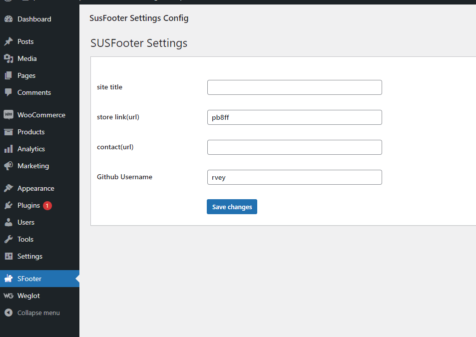

## brief 9

plugin qui ajoute un footer en bas des pages.

## installation

- Copiez le dossier Sfooter puis le placez dans le chemain suivant : "VotreSiteWeb"/wp-content/plugins
- Ouvrez la page admin dans votre navigateur, puis clickez sur "Plugins" -> "Installed plugins"
- Activez le plugins sous le nom SFooter
- Une nouvelle option sous le nom SFooter a été ajoutée, clickez le
- Remplir les champs puis clickez sur le button "Save changes

